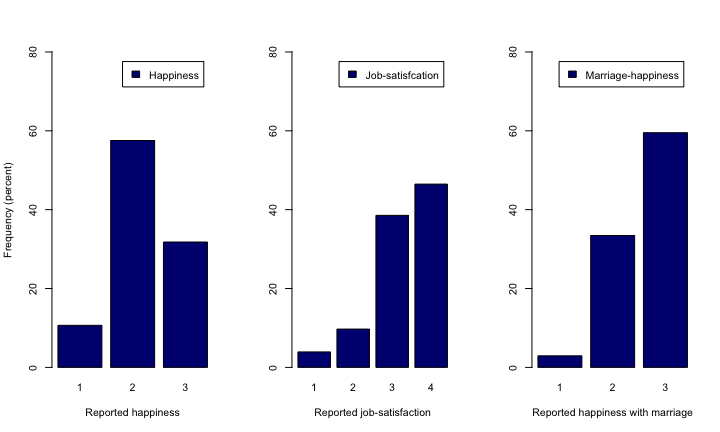
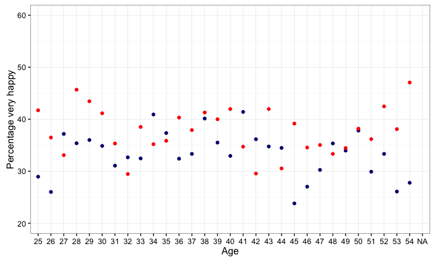
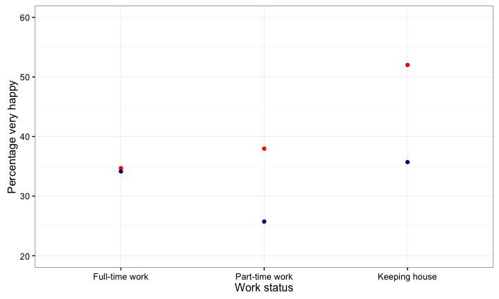
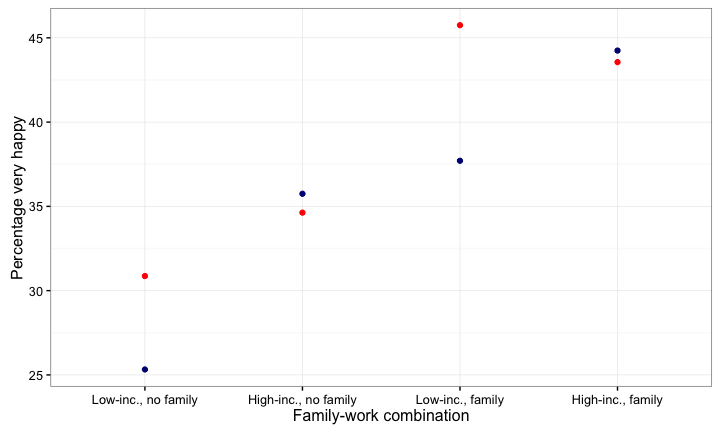
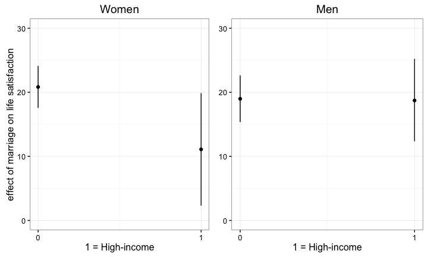

# Can we have it all?
Philip Unger & Philipp Staender  
2 May 2016  

## Intro

Research Question

*"Are career pursuits reconcilable with a happy life?"* 

The debate

*'I still strongly believe that women can “have it all” (and that men can too). ... But not today, not with the way America’s economy and society are currently structured.'*

Anne-Marie Slaughter - Former director of policy planning for the U.S. State Department

## Research Design 

### Data

General Social Survey

- Cross-sectional survey of the adult population in the United States
- Conducted between 1972 to 2014
- Sample size around 60,000

Current Population Survey

- used to generate income percentiles in age and educational groups (reference group income)

Personal Consumption Expenditure (price-deflator)

## Research Design 

Methodology

- Graphical analysis
- Linear Probability Model

Operationalization

- Defining career
- Sample heterogeneity 

# Descriptive statistics

## Measures of happiness

Figure 1: Distribution of reported happiness, job-satisfaction and happiness with marriage

## Gender and age

Figure 2: Happiness and age

*Sample restrictions: college educated men and women*

## Labour-market affiliation

Figure 3: Happiness and labour-market affiliation

*Sample restrictions: college educated men and women*

## Family status and income

Figure 4: Happiness and family constellation

*Sample restrictions: college educated men and women*

# Regression analysis

## Model 1: Interaction effects of marriage and job income {.smaller}

<table style="text-align:center"><tr><td colspan="3" style="border-bottom: 1px solid black"></td></tr><tr><td style="text-align:left"></td><td colspan="2"><em>Dependent variable:</em></td></tr>
<tr><td></td><td colspan="2" style="border-bottom: 1px solid black"></td></tr>
<tr><td style="text-align:left"></td><td colspan="2">Very happy</td></tr>
<tr><td style="text-align:left"></td><td>Women</td><td>Men</td></tr>
<tr><td style="text-align:left"></td><td>(1)</td><td>(2)</td></tr>
<tr><td colspan="3" style="border-bottom: 1px solid black"></td></tr><tr><td style="text-align:left">High-income</td><td>8.030**</td><td>7.849**</td></tr>
<tr><td style="text-align:left"></td><td>(3.587)</td><td>(3.125)</td></tr>
<tr><td style="text-align:left"></td><td></td><td></td></tr>
<tr><td style="text-align:left">Married</td><td>20.892***</td><td>18.986***</td></tr>
<tr><td style="text-align:left"></td><td>(1.670)</td><td>(1.856)</td></tr>
<tr><td style="text-align:left"></td><td></td><td></td></tr>
<tr><td style="text-align:left">High-income*Married</td><td>-9.705**</td><td>-0.200</td></tr>
<tr><td style="text-align:left"></td><td>(4.786)</td><td>(3.719)</td></tr>
<tr><td style="text-align:left"></td><td></td><td></td></tr>
<tr><td style="text-align:left">Constant</td><td>83.524**</td><td>-13.145</td></tr>
<tr><td style="text-align:left"></td><td>(34.495)</td><td>(29.980)</td></tr>
<tr><td style="text-align:left"></td><td></td><td></td></tr>
<tr><td colspan="3" style="border-bottom: 1px solid black"></td></tr><tr><td style="text-align:left">Age</td><td>Yes</td><td>Yes</td></tr>
<tr><td style="text-align:left">Age-squared</td><td>Yes</td><td>Yes</td></tr>
<tr><td style="text-align:left">Year</td><td>Yes</td><td>Yes</td></tr>
<tr><td style="text-align:left">Race</td><td>Yes</td><td>Yes</td></tr>
<tr><td style="text-align:left">Cohort</td><td>Yes</td><td>Yes</td></tr>
<tr><td colspan="3" style="border-bottom: 1px solid black"></td></tr><tr><td style="text-align:left">Observations</td><td>4,014</td><td>3,850</td></tr>
<tr><td style="text-align:left">R2</td><td>0.061</td><td>0.055</td></tr>
<tr><td style="text-align:left">Adjusted R2</td><td>0.051</td><td>0.044</td></tr>
<tr><td style="text-align:left">Residual Std. Error</td><td>47.229 (df = 3970)</td><td>46.217 (df = 3806)</td></tr>
<tr><td style="text-align:left">F Statistic</td><td>6.035*** (df = 43; 3970)</td><td>5.164*** (df = 43; 3806)</td></tr>
<tr><td colspan="3" style="border-bottom: 1px solid black"></td></tr><tr><td style="text-align:left"><em>Note:</em></td><td colspan="2" style="text-align:right">*p<0.1; **p<0.05; ***p<0.01</td></tr>
</table>
*Sample restrictions: college educated men and women*

## Illustration of interaction effect

Figure 5: Interaction effects of marriage and job income on life satisfaction

## Model 2: Double-click on married individuals {.smaller}

<table style="text-align:center"><tr><td colspan="3" style="border-bottom: 1px solid black"></td></tr><tr><td style="text-align:left"></td><td colspan="2"><em>Dependent variable:</em></td></tr>
<tr><td></td><td colspan="2" style="border-bottom: 1px solid black"></td></tr>
<tr><td style="text-align:left"></td><td colspan="2">Very happy</td></tr>
<tr><td style="text-align:left"></td><td>Women</td><td>Men</td></tr>
<tr><td style="text-align:left"></td><td>(1)</td><td>(2)</td></tr>
<tr><td colspan="3" style="border-bottom: 1px solid black"></td></tr><tr><td style="text-align:left">High-income</td><td>1.864</td><td>8.483***</td></tr>
<tr><td style="text-align:left"></td><td>(3.823)</td><td>(2.748)</td></tr>
<tr><td style="text-align:left"></td><td></td><td></td></tr>
<tr><td style="text-align:left">Keeping house</td><td>6.110**</td><td>-3.897</td></tr>
<tr><td style="text-align:left"></td><td>(3.064)</td><td>(11.620)</td></tr>
<tr><td style="text-align:left"></td><td></td><td></td></tr>
<tr><td style="text-align:left">Constant</td><td>151.317***</td><td>7.694</td></tr>
<tr><td style="text-align:left"></td><td>(46.158)</td><td>(39.116)</td></tr>
<tr><td style="text-align:left"></td><td></td><td></td></tr>
<tr><td colspan="3" style="border-bottom: 1px solid black"></td></tr><tr><td style="text-align:left">Partner's income</td><td>Yes</td><td>Yes</td></tr>
<tr><td style="text-align:left">Age</td><td>Yes</td><td>Yes</td></tr>
<tr><td style="text-align:left">Age-squared</td><td>Yes</td><td>Yes</td></tr>
<tr><td style="text-align:left">Year</td><td>Yes</td><td>Yes</td></tr>
<tr><td style="text-align:left">Race</td><td>Yes</td><td>Yes</td></tr>
<tr><td style="text-align:left">Cohort</td><td>Yes</td><td>Yes</td></tr>
<tr><td colspan="3" style="border-bottom: 1px solid black"></td></tr><tr><td style="text-align:left">Observations</td><td>2,362</td><td>2,446</td></tr>
<tr><td style="text-align:left">R2</td><td>0.049</td><td>0.040</td></tr>
<tr><td style="text-align:left">Adjusted R2</td><td>0.024</td><td>0.017</td></tr>
<tr><td style="text-align:left">Residual Std. Error</td><td>49.268 (df = 2300)</td><td>48.653 (df = 2388)</td></tr>
<tr><td style="text-align:left">F Statistic</td><td>1.939*** (df = 61; 2300)</td><td>1.725*** (df = 57; 2388)</td></tr>
<tr><td colspan="3" style="border-bottom: 1px solid black"></td></tr><tr><td style="text-align:left"><em>Note:</em></td><td colspan="2" style="text-align:right">*p<0.1; **p<0.05; ***p<0.01</td></tr>
</table>
*Sample restrictions: married, college educated men and women*

## Outlook

- Investigate drivers of when overall happiness and work satisfaction differ
  + Regression design where sample is limited to individuals reporting high job-satisfaction
  + Investigate effects of work intensity

